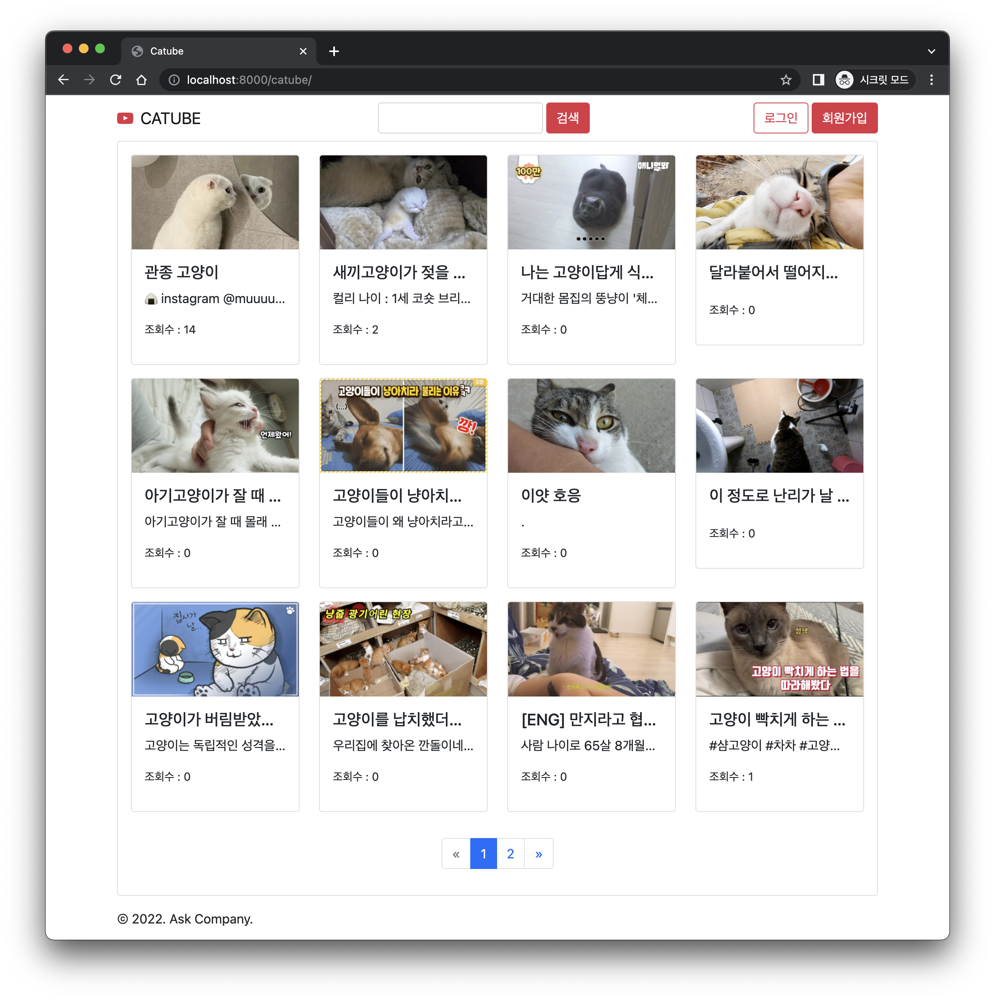

# CATUBE

Ask Django 라이브 코딩쇼

윈도우/맥/리눅스에 관계없이 아래 과정으로 본 장고 프로젝트를 구동하실 수 있습니다.

## 프로젝트 준비

파이썬 3.6 이상을 사용해주세요. 장고 3.X 부터는 파이썬 3.6 이상을 지원합니다.

```sh
python --version
```

git을 통해 다음과 같이 소스코드를 가져오실 수 있으시며,

```sh
git clone git@github.com:allieus/livecodingshow-catube.git
cd livecodingshow-catube
```

혹은 https://github.com/allieus/livecodingshow-catube/archive/master.zip 주소에서 다운받아 압축을 푸셔도 됩니다.

명령프롬프트 혹은 파워쉘을 통해 manage.py가 있는 디렉토리 경로까지 이동하신 후에, 다음 명령으로 필요한 팩키지를 설치하실 수 있습니다. requirements.txt 파일에는 3개 라이브러리 (`django`, `django-bootstrap-v5`, `pillow`)가 명시되어있습니다.

```sh
pip install -r requirements.txt
```

이제 장고의 migrate 명령으로 데이터베이스를 생성해줍니다. 본 프로젝트는 SQLite 데이터베이스가 기본 세팅되어있습니다.

```sh
python manage.py migrate
```

다음과 같이 개발 서버를 띄우실 수 있습니다.

```sh
python manage.py runserver
```

## 구동화면



